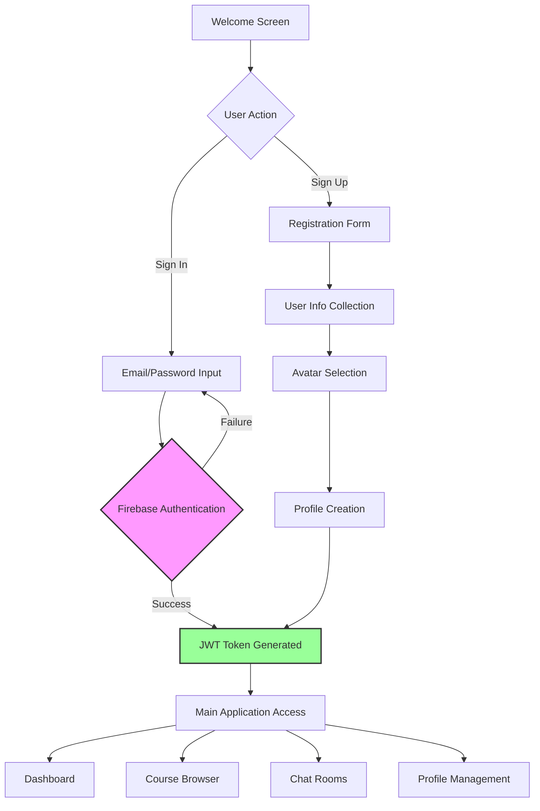

# GROW 🌱

A comprehensive student-centric platform that provides course information, real-time chat functionality, and course review features to enhance the academic experience.

## 📋 Table of Contents

-   [Overview](#overview)
-   [Features](#features)
-   [Tech Stack](#tech-stack)
-   [Architecture](#architecture)
-   [Project Structure](#project-structure)
-   [Authentication Flow](#authentication-flow)
-   [Installation](#installation)
-   [Usage](#usage)
-   [API Integration](#api-integration)
-   [Environment Configuration](#environment-configuration)
-   [Contributing](#contributing)
<!-- -   [Screenshots](#screenshots) -->

## 🎯 Overview

GROW is a React Native mobile application designed to create a collaborative learning environment for students. The platform combines course management, real-time communication, and peer review systems to foster academic engagement and community building.

Built with a **hybrid architecture** that leverages both Firebase services for real-time features and a custom REST API for complex data operations, GROW provides a seamless and scalable educational platform.

### Key Objectives

-   **Course Discovery**: Browse and explore available courses with detailed information and sections
-   **Real-time Communication**: Instant messaging for both group discussions and private conversations
-   **Peer Reviews**: Share and read course reviews from fellow students with rating systems
-   **Analytics Dashboard**: Visualize course popularity and chat activity trends
-   **Community Building**: Connect students through course-specific discussions

## ✨ Features

### 🔐 Authentication System

-   Email/password authentication via Firebase Auth
-   JWT token-based API authorization
-   User profile creation with personal information
-   Avatar selection and customization
-   Secure session management

### 💬 Real-time Chat System

-   **Group Chat**: Course-specific public chat rooms with live participant management
-   **Private Chat**: One-on-one messaging between students with unique chat IDs
-   **Media Sharing**: Image upload and sharing capabilities via Firebase Storage
-   **Live Synchronization**: Real-time message delivery using Firebase Realtime Database
-   **Message History**: Persistent chat history with timestamp tracking

### 📚 Course Management

-   Comprehensive course catalog with search functionality
-   Detailed course information including sections and enrollment data
-   Course popularity analytics with interactive charts
-   Trending courses based on chat activity metrics
-   Course-specific chat room creation and management

### ⭐ Review System

-   Student-generated course reviews with 1-5 star ratings
-   Review browsing with filtering and sorting options
-   Like/dislike functionality for review helpfulness
-   Review editing capabilities for authors
-   Detailed review analytics per course

### 📊 Analytics Dashboard

-   Interactive line charts showing daily course chat activity
-   Real-time trending courses visualization
-   User engagement metrics and statistics
-   Course popularity ranking system

## 🛠 Tech Stack

### Frontend Framework

-   **React Native** (0.76.7) - Cross-platform mobile development
-   **Expo SDK** (~52.0.35) - Development platform and build tools
-   **TypeScript** (5.3.3) - Static type checking and enhanced developer experience
-   **React Navigation** (7.x) - Navigation management with Stack and Tab navigators

### Backend & Database (Hybrid Architecture)

-   **Vercel-hosted REST API** (`grow-ruddy.vercel.app`) - Course data, reviews, and complex queries
-   **PostgreSQL** - Primary relational database for course information, reviews, and user data
-   **Firebase Realtime Database** - Real-time chat message synchronization
-   **Firebase Firestore** - User profiles and supplementary document storage
-   **Firebase Storage** - Image and media file storage with CDN
-   **Firebase Authentication** - User authentication and JWT token management

### UI/UX Libraries

-   **Expo Linear Gradient** - Gradient backgrounds and visual effects
-   **React Native Vector Icons** (Ionicons) - Consistent icon system
-   **React Native Reanimated** (3.17.5) - Smooth animations and transitions
-   **React Native Chart Kit** (6.12.0) - Data visualization components
-   **React Native SVG** (15.11.2) - Vector graphics rendering
-   **React Native Pie Chart** (4.0.1) - Circular data visualization

### Media & Interaction

-   **Expo Image Picker** (16.0.6) - Camera and gallery access
-   **React Native Gesture Handler** (2.25.0) - Touch interactions
-   **Expo AV** (15.0.2) - Audio/video capabilities
-   **React Native Safe Area Context** - Screen boundary management

### Development Tools

-   **Expo Font** - Custom font integration (Nunito family)
-   **Babel Core** - JavaScript compilation
-   **Metro** - React Native bundler

## 🏗 Architecture

### Hybrid System Design

GROW implements a sophisticated hybrid architecture that combines the best of both Firebase services and custom REST API solutions:

```
┌─────────────────────────────────────────────────────────────┐
│                    React Native Application                 │
├─────────────────────────────────────────────────────────────┤
│                    Authentication Layer                     │
│              Firebase Auth + JWT Token Management           │
├─────────────────────────────────────────────────────────────┤
│                                                             │
│  ┌─────────────────────┐    ┌─────────────────────────────┐ │
│  │   Firebase Services │    │     REST API Server         │ │
│  │                     │    │   (grow-ruddy.vercel.app)   │ │
│  │ • Realtime Database │◄──►│                             │ │
│  │   (Chat Messages)   │    │ • Course Catalog            │ │
│  │ • Cloud Storage     │    │ • Review System             │ │
│  │   (Media Files)     │    │ • User Analytics            │ │
│  │ • User Profiles     │    │ • Section Management        │ │
│  │                     │    │                             │ │
│  └─────────────────────┘    │ ┌─────────────────────────┐ │ │
│                             │ │    PostgreSQL Database  │ │ │
│                             │ │                         │ │ │
│                             │ │ • Course Information    │ │ │
│                             │ │ • Student Reviews       │ │ │
│                             │ │ • User Relationships    │ │ │
│                             │ │ • Analytics Data        │ │ │
│                             │ └─────────────────────────┘ │ │
│                             └─────────────────────────────┘ │
└─────────────────────────────────────────────────────────────┘
```

### Navigation Architecture

```
App.tsx (Stack Navigator)
├── Authentication Flow
│   ├── WelcomeScreen
│   ├── SignIn
│   ├── SignUp
│   ├── UserInfo
│   └── AvatarScreen
└── Main Application
    ├── MainTabs (Tab Navigator)
    │   ├── Home (Dashboard & Analytics)
    │   ├── Courses (Course Catalog)
    │   ├── ChatList (Chat Management)
    │   └── Profile (User Settings)
    └── Detail Screens
        ├── CourseDetails (with embedded Tab Navigator)
        ├── CourseChat (Group Messaging)
        ├── PrivateChat (1-on-1 Messaging)
        ├── Review (Review Creation)
        ├── ReviewDetail (Review Viewing)
        └── EditProfile (Profile Management)
```

### Data Flow Strategy

-   **Real-time Operations**: Firebase Realtime Database for instant chat synchronization
-   **Complex Queries**: PostgreSQL via REST API for course searches and analytics
-   **Media Management**: Firebase Storage for optimized file delivery
-   **Authentication**: Firebase Auth with JWT tokens for API authorization

## 📁 Project Structure

```
BuckyClass/
├── src/
│   ├── screens/                    # Screen components organized by feature
│   │   ├── SignIn/                # Authentication screens
│   │   │   ├── SignIn.tsx
│   │   │   ├── UserInfoScreen.tsx
│   │   │   └── Avatar.tsx
│   │   ├── HomeScreen/            # Dashboard and analytics
│   │   │   ├── HomeScreen.tsx
│   │   │   └── HomeScreen_CSS.ts
│   │   ├── CoursesScreen/         # Course catalog management
│   │   │   └── CoursesScreen.tsx
│   │   ├── CourseDetail/          # Individual course views
│   │   │   └── CourseDetailsScreen.tsx
│   │   ├── ChatListScreen/        # Chat room management
│   │   │   └── ChatListScreen.tsx
│   │   ├── CourseChatScreen.tsx   # Group chat functionality
│   │   ├── PrivateChatScreen.tsx  # Direct messaging
│   │   ├── ReviewScreen.tsx       # Review creation
│   │   ├── ReviewDetailScreen.tsx # Review display
│   │   ├── ProfileScreen.tsx      # User profile
│   │   ├── EditProfileScreen.tsx  # Profile editing
│   │   └── WelcomeScreen.tsx      # App introduction
│   ├── components/                # Reusable UI components
│   │   └── BottomNavBar.tsx
│   ├── types/                     # TypeScript type definitions
│   │   └── navigation.ts
│   ├── firebaseConfig.ts          # Firebase service configuration
│   └── App.tsx                    # Main application and navigation setup
├── assets/                        # Static resources
│   ├── fonts/                     # Custom fonts (Nunito family)
│   ├── images/                    # App icons and graphics
│   └── adaptive-icon.png
├── app/                          # Expo Router files (if applicable)
├── app.json                      # Expo configuration
├── package.json                  # Dependencies and scripts
├── tsconfig.json                 # TypeScript configuration
└── index.ts                      # Application entry point
```

## 🔐 Authentication Flow



## 🚀 Installation

### Prerequisites

-   **Node.js** (v16 or higher)
-   **npm** or **yarn** package manager
-   **Expo CLI** (`npm install -g @expo/cli`)
-   **iOS Simulator** (for iOS development on macOS)
-   **Android Studio** (for Android development)
-   **Git** for version control

### Setup Steps

1. **Clone the repository**

    ```bash
    git clone https://github.com/wdragj/BuckyClass-mobile-ReactNative.git
    cd BuckyClass-mobile-ReactNative/BuckyClass
    ```

2. **Install dependencies**

    ```bash
    npm install
    # or using yarn
    yarn install
    ```

3. **Configure Firebase**

    - Create a new Firebase project at [Firebase Console](https://console.firebase.google.com)
    - Enable the following services:
        - **Authentication** (Email/Password provider)
        - **Realtime Database**
        - **Cloud Firestore**
        - **Storage**
    - Download the configuration file and update `src/firebaseConfig.ts`

4. **Set up environment variables**

    ```bash
    # Create .env file in the project root
    EXPO_PUBLIC_API_URL=https://grow-ruddy.vercel.app
    ```

5. **Install Expo CLI globally (if not already installed)**

    ```bash
    npm install -g @expo/cli
    ```

6. **Start the development server**

    ```bash
    expo start
    ```

7. **Run on device/simulator**
    - **Mobile Device**: Install Expo Go app and scan the QR code
    - **iOS Simulator**: Press `i` in the terminal
    - **Android Emulator**: Press `a` in the terminal
    - **Web Browser**: Press `w` in the terminal

## 📱 Usage

### For Students

1. **Account Creation**: Register with email and password
2. **Profile Setup**: Complete user information and select an avatar
3. **Course Exploration**: Browse available courses with detailed information
4. **Join Discussions**: Participate in course-specific group chats
5. **Private Messaging**: Connect with classmates through direct messages
6. **Share Reviews**: Write comprehensive course reviews with ratings
7. **View Analytics**: Monitor course popularity and chat activity trends

### For Developers

-   **Type Safety**: Leverage TypeScript for robust development
-   **Component Structure**: Follow established patterns for new features
-   **Real-time Features**: Use Firebase SDK for live data synchronization
-   **API Integration**: Implement proper error handling for REST endpoints
-   **State Management**: Utilize React Hooks for component state

## 🔗 API Integration

### REST API Endpoints (grow-ruddy.vercel.app)

#### Course Management

```javascript
// Fetch complete course catalog
GET /api/courses
Headers: { Authorization: 'Bearer <firebase-jwt-token>' }

// Get detailed course information
GET /api/courses/:courseId
Headers: { Authorization: 'Bearer <firebase-jwt-token>' }

// Get course sections and enrollment data
GET /api/courses/sections/:courseId
Headers: { Authorization: 'Bearer <firebase-jwt-token>' }
```

#### Review System

```javascript
// Submit new course review
POST /api/reviews
Headers: {
  'Content-Type': 'application/json',
  'Authorization': 'Bearer <firebase-jwt-token>'
}
Body: {
  course_id: string,
  user_id: string,
  rating: number,
  comment: string
}

// Fetch reviews for specific course
GET /api/reviews/:courseId
Headers: { Authorization: 'Bearer <firebase-jwt-token>' }
```

### Firebase Realtime Database Structure

```json
{
  "chats": {
    "courseId_or_privateId": {
      "type": "group" | "private",
      "name": "Course Chat Room",
      "createdAt": 1634567890000,
      "participants": {
        "userId1": true,
        "userId2": true
      },
      "messages": {
        "messageId": {
          "text": "Message content",
          "imageUrl": "https://storage.url/image.jpg",
          "senderUid": "user123",
          "senderName": "John Doe",
          "timestamp": 1634567890000
        }
      }
    }
  },
  "users": {
    "userId": {
      "displayName": "Student Name",
      "email": "student@university.edu",
      "avatar": "avatar_url",
      "createdAt": 1634567890000
    }
  }
}
```

### Authentication Flow

```javascript
// Firebase ID Token generation
const auth = getAuth();
const user = auth.currentUser;
const idToken = await user.getIdToken(true);

// API request with authentication
fetch("https://grow-ruddy.vercel.app/api/courses", {
    headers: {
        Authorization: `Bearer ${idToken}`,
        "Content-Type": "application/json",
    },
});
```

## ⚙️ Environment Configuration

### Required Environment Variables

```bash
# .env file
EXPO_PUBLIC_API_URL=https://grow-ruddy.vercel.app
EXPO_PUBLIC_FIREBASE_API_KEY=your_firebase_api_key
EXPO_PUBLIC_FIREBASE_AUTH_DOMAIN=your_project.firebaseapp.com
EXPO_PUBLIC_FIREBASE_PROJECT_ID=your_project_id
```

### Firebase Configuration

Update `src/firebaseConfig.ts` with your Firebase project credentials:

```typescript
const firebaseConfig = {
    apiKey: "your_api_key",
    authDomain: "your_project.firebaseapp.com",
    databaseURL: "https://your_project.firebaseio.com",
    projectId: "your_project_id",
    storageBucket: "your_project.appspot.com",
    messagingSenderId: "your_sender_id",
    appId: "your_app_id",
};
```

## 🤝 Contributing

### Development Guidelines

1. **Fork** the repository and create a feature branch
2. **Follow** TypeScript best practices and existing code patterns
3. **Test** all features on both iOS and Android platforms
4. **Document** new features and API changes
5. **Submit** a detailed Pull Request with screenshots

### Code Style Guidelines

-   Use **TypeScript** for all new components and features
-   Follow **React Native** best practices for performance
-   Implement **proper error handling** for network requests
-   Add **loading states** and **user feedback** for async operations
-   Ensure **responsive design** for different screen sizes
-   Include **comments** for complex business logic

<!-- ### Commit Message Format

```
feat: add course section filtering functionality
fix: resolve chat message ordering issue
docs: update API documentation
style: improve course card component styling
``` -->

<!-- ## 📸 Screenshots

_[Screenshots would be inserted here showcasing key features like the dashboard, course browser, chat interface, and review system]_ -->

## 🔮 Future Enhancements

-   **Push Notifications**: Real-time chat and course update notifications
-   **Offline Support**: Cache course data for offline viewing
-   **Advanced Analytics**: Detailed user engagement metrics
-   **Video Integration**: Support for course-related video content
-   **Calendar Integration**: Sync with university course schedules
-   **Accessibility**: Enhanced screen reader and navigation support

## 📄 License

This project is licensed under the MIT License - see the [LICENSE](LICENSE) file for details.

## 👥 Development Team

-   **Mobile Development**: React Native with TypeScript
-   **Backend Architecture**: Firebase + PostgreSQL hybrid system
-   **UI/UX Design**: Modern, accessible mobile interface
<!-- -   **Real-time Systems**: Firebase Realtime Database integration
-   **API Development**: RESTful services with JWT authentication -->

## 🙏 Acknowledgments

-   **Firebase** for providing robust real-time backend services
-   **Expo** for streamlining the React Native development process
-   **Vercel** for reliable API hosting and deployment
-   **React Native Community** for excellent documentation and support
-   **University Students** for feedback and feature suggestions

---

**GROW** - Growing together through collaborative learning 🌱

_Building connections, sharing knowledge, fostering academic success_
